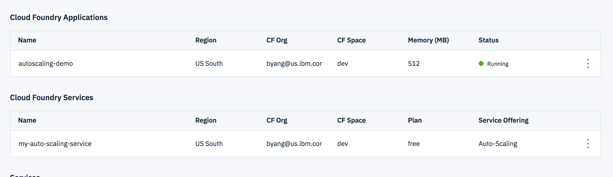
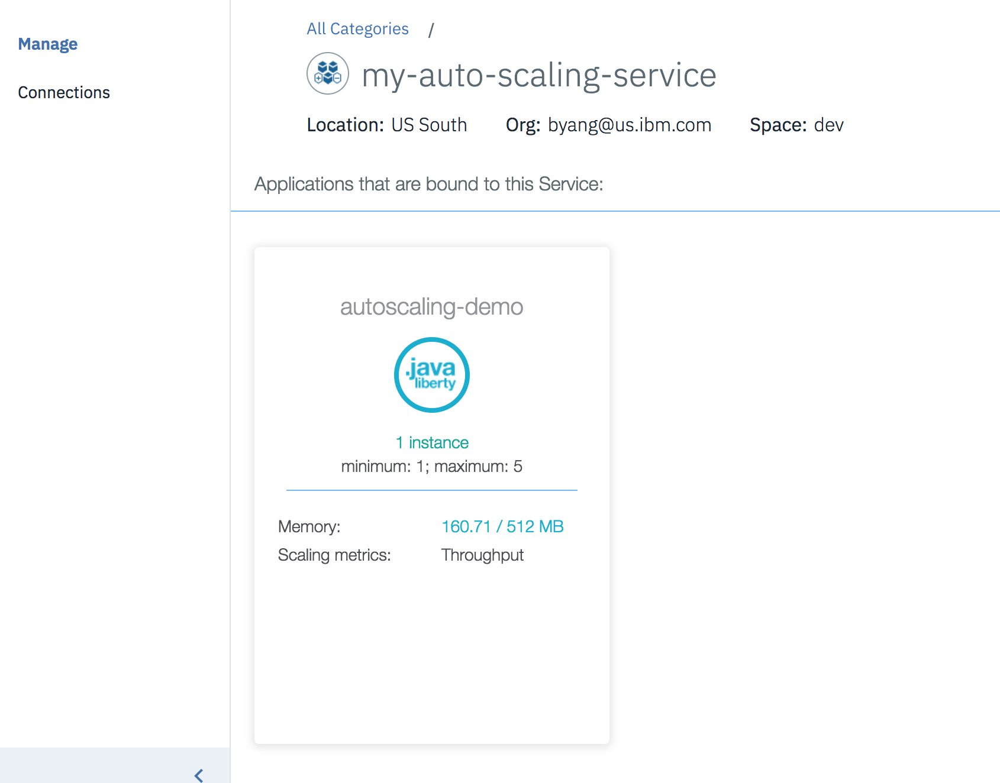
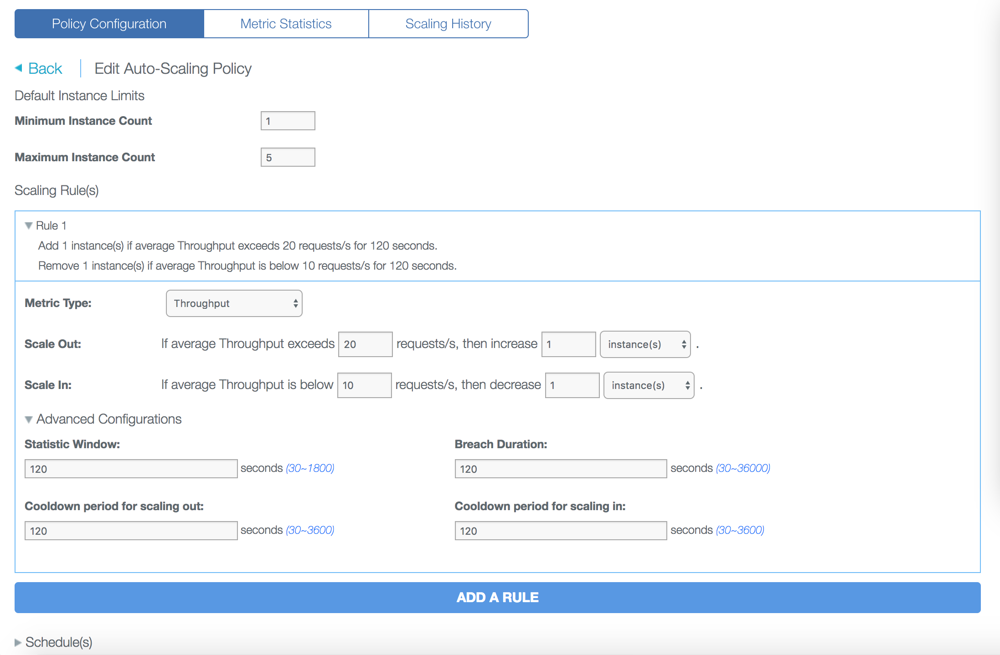
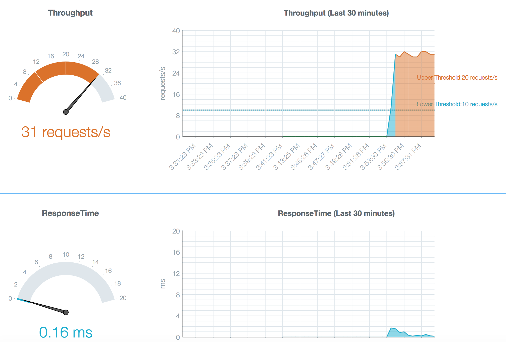
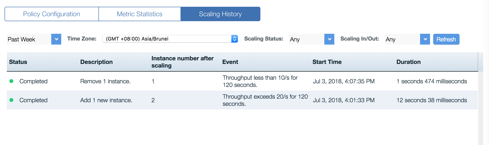

# IBM Cloud AutoScaler Demo

This project provides a demonstration guide of how to use [Auto-Scaling service][auto_scaling_service_url] to horizontally scale cloud foundry applications in [IBM Cloud][ibm_cloud_url]. 

## System requirements

* [IBM Cloud CLI][ibm_cloud_cli]
* [Apache HTTP server benchmarking tool `ab`](http://httpd.apache.org/download.cgi)


## Deploy the demo app to IBM Cloud

1. Clone the project and change to `app` directory

  ```
  $ git clone https://github.com/boyang9527/ibmcloud-autoscaler-demo.git
  $ cd ibmcloud-autoscaler-demo/app
  ```


2. Edit file `manifest.yml`  and change  `host`  to your own host name (the host you use will determin your application url)

```
applications:
- name: autoscaler-demo
  host: autoscaler-demo
  memory: 256M
```

3. If you do not have a IBM Cloud account, [sign up here][ibm_cloud_signup_url]

4. Use [IBM Cloud CLI][ibm_cloud_cli] to login IBM Cloud,  target  public Cloud Foundry and an org/space

  ```
  $ ibmcloud api https://api.ng.bluemix.net
  $ ibmcloud login
  $ ibmcloud target --cf
  ```

5. Push your app to IBM Cloud

  ```
  $ ibmcloud cf push
  ```

6. verify the app url `https://autoscaler-demo.mybluemix.net` is accessible

  
## Bind the app with Auto-Scaling service

1. Create the Auto-Scaling service in IBM Cloud

  ```
  $ ibmcloud cf create-service Auto-Scaling free my-auto-scaling-service
  ```

2. Bind and restage your app

  ```
  $ ibmcloud cf bind-service autoscaler-demo my-auto-scaling-service
  $ ibmcloud cf restage autoscaler-demo
  ```

## Attach a policy to the app

### Option 1: Using IBM Cloud Console:

1. Go to the IBM Cloud dashboard and enter the Auto-Scaling service console. 



2. Create an auto-scaling policy as below with the following parameters:
  * Metric type: `Throughput`
	* If average Throughput exceeds 20 requests/s, then increase `1` instance
	* If average Throughput is below 10 requests/s, then decrease `1` instance
	* Statistic Window: `120 seconds`
	* Breach Duration: `120 seconds`
	* Cooldown period for scaling out: `120 seconds`
	* Cooldown period for scaling in: `120 seconds`
	



### Option 2: Using IBM Cloud CLI


1. Install Auto-Scaling CLI plug-in:

```
$ ibmcloud plugin install auto-scaling
```
  
2. Attach an auto-scaling policy

```
$ cd ..
$ ibmcloud as policy-attach autoscaler-demo -p policy.json
```

## Load test using Apache benchmarking tool


1. Add load test on the app

```
ab -n 100000 -c 100 https://autoscaler-demo.mybluemix.net/
```

2. Observe the metrics in console



4. Wait for about 2~5 minutes, use the command to see the current instances (And voila! Your app scaled to 2 instances as expected!)

```
$ ibmcloud cf app autoscaler-demo
Showing health and status for app autoscaler-demo in org myorg / space myspace as user@example.com...

name:              autoscaler-demo
requested state:   started
instances:         2/2
usage:             256M x 2 instances
routes:            autoscaler-demo.mybluemix.net
last uploaded:     Fri 16 Nov 13:58:39 PST 2018
stack:             cflinuxfs2
buildpack:         SDK for Node.js(TM) (ibm-node.js-6.14.4, buildpack-v3.22-20180904-1913)

     state     since                  cpu    memory          disk         details
#0   running   2018-11-16T22:03:58Z   1.6%   68.2M of 256M   104M of 1G
#1   running   2018-11-16T22:12:42Z   0.4%   69.2M of 256M   104M of 1G
     
```


5. Shut down the ab test with `command/ctrl + c`, wait for about 2~5 minutes, your app will scale to 1

6. Observe the scaling history in console




[ibm_cloud_signup_url]: https://cloud.ibm.com/registration/
[ibm_cloud_url]: https://cloud.ibm.com/
[auto_scaling_service_url]: https://cloud.ibm.com/catalog/services/auto-scaling/
[ibm_cloud_cli]: https://cloud.ibm.com/docs/cli/reference/bluemix_cli/download_cli.html#install_use
[cloud_foundry_url]: https://github.com/cloudfoundry/cli

